# Taller 4 — Lo que aprendí sobre redes neuronales

## 1. Introducción

En este taller aprendí cómo una red neuronal puede usar ejemplos para aprender a clasificar información. Primero trabajé con imágenes de vidrio y plástico. Después revisé otro ejercicio en el que una red clasifica opiniones de películas como positivas o negativas.

Lo que entendí es que no se le escribe una regla para cada imagen o comentario. Se le dan ejemplos con sus respuestas correctas y, durante el entrenamiento, el modelo va ajustando sus cálculos.


## 2. ¿Qué quería aprender?

- Entender cómo una red puede distinguir imágenes.
- Separar los datos para aprender, revisar el avance y hacer una prueba final.
- Comprender qué hace el código durante el entrenamiento.
- Comparar una red creada desde cero con una que ya había sido entrenada.
- Leer las gráficas para reconocer cuándo el modelo mejora y cuándo empieza a sobreajustarse.

## 3. Los datos y su división

Para las imágenes se utilizó TrashNet. Este conjunto tiene diferentes tipos de residuos, pero en el ejercicio solo se trabajó con dos:

| Número que usa el modelo | Nombre en el código | Material |
|---|---|---|
| 0 | `glass` | Vidrio |
| 1 | `plastic` | Plástico |

Los datos se dividieron en tres grupos:

| Grupo | Imágenes | ¿Para qué sirve? |
|---|---:|---|
| Entrenamiento | 687 | Para que el modelo aprenda |
| Validación | 147 | Para revisar cómo va con ejemplos que no usa para ajustar sus pesos |
| Prueba | 149 | Para comprobar el resultado al terminar |
| **Total** | **983** | |

Estas cantidades equivalen aproximadamente a 70 %, 15 % y 15 %. La división la realiza la clase `TrashDataset`, que se importa desde `trash_dataset.py`. Ese archivo no está dentro del notebook compartido, por lo que no puedo confirmar cómo hace la separación internamente.

Entendí esta división como estudiar con unos ejercicios, practicar con otros y rendir un examen con preguntas diferentes. Así se puede comprobar si el modelo aprendió algo que también le sirve con ejemplos nuevos.

## 4. Preparación de las imágenes

Antes de entrar al modelo, las imágenes se convierten en números. En este ejercicio llegan en escala de grises, con un solo canal y un tamaño de 384 × 512 píxeles.

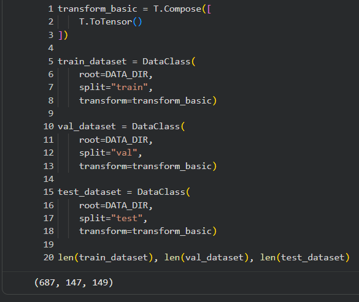

**Lo que hace este código:** `T.ToTensor()` convierte la imagen a un formato numérico que PyTorch puede usar. `split="train"`, `split="val"` y `split="test"` seleccionan cada grupo. Al final, `len()` muestra cuántas imágenes tiene cada uno.

El modelo recibe grupos de hasta 128 imágenes, llamados **lotes**. `shuffle=True` mezcla el orden de los ejemplos de entrenamiento.


**Qué me muestra esta imagen:** permite ver los ejemplos que recibe la red y comprobar sus etiquetas. Los objetos tienen distintas formas, posiciones y apariencias. Por eso el modelo necesita aprender características que le ayuden a distinguir los materiales en diferentes imágenes.

## 5. ¿Cómo funciona la CNN?

Una CNN es un tipo de red neuronal que se utiliza para trabajar con imágenes. Revisa pequeñas partes de la imagen y aprende a detectar características útiles, como bordes, texturas y formas.

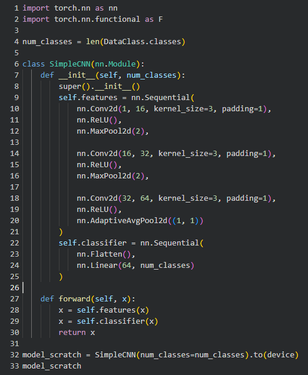

**Así entendí sus partes:**

| Parte del código | Explicación sencilla |
|---|---|
| `Conv2d` | Aplica filtros pequeños que buscan patrones en la imagen |
| `ReLU` | Deja los valores positivos y cambia los negativos a cero; ayuda a aprender relaciones más variadas |
| `MaxPool2d` | Reduce el tamaño de la información y conserva los valores más altos de cada zona |
| `AdaptiveAvgPool2d` | Resume cada mapa de características con un promedio |
| `Flatten` | Ordena esos valores en una sola lista |
| `Linear` | Usa la lista para producir una puntuación para vidrio y otra para plástico |

La red tiene tres capas de convolución, con 16, 32 y 64 filtros. La salida final tiene dos puntuaciones. Durante la evaluación se convierten en probabilidades con una operación llamada `softmax`.

Lo importante para mí es que cada parte cumple una tarea: algunas buscan características, otras resumen la información y la última ayuda a decidir la clase.

## 6. ¿Cómo aprende el modelo?

El modelo aprende repitiendo un proceso: recibe imágenes, responde, compara sus respuestas con las etiquetas correctas y ajusta sus pesos. Los **pesos** son números internos que cambian durante el aprendizaje.

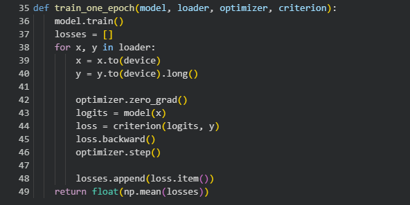

**Lo que hace el código, paso a paso:**

1. `model.train()` pone la red en modo de entrenamiento.
2. `optimizer.zero_grad()` limpia los cálculos de ajuste del lote anterior.
3. `model(x)` obtiene las respuestas para las imágenes.
4. `criterion(logits, y)` calcula la pérdida, que mide qué tan buenas o malas fueron las respuestas.
5. `loss.backward()` calcula cómo influyen los pesos en esa pérdida.
6. `optimizer.step()` modifica los pesos para intentar reducirla.

Una **época** es una pasada por todo el grupo de entrenamiento. La CNN básica se entrenó durante 8 épocas, usando Adam para actualizar los pesos y una tasa de aprendizaje de 0,001. Esa tasa controla el tamaño de los ajustes.

### 6.1. ¿Qué pasó con la pérdida?

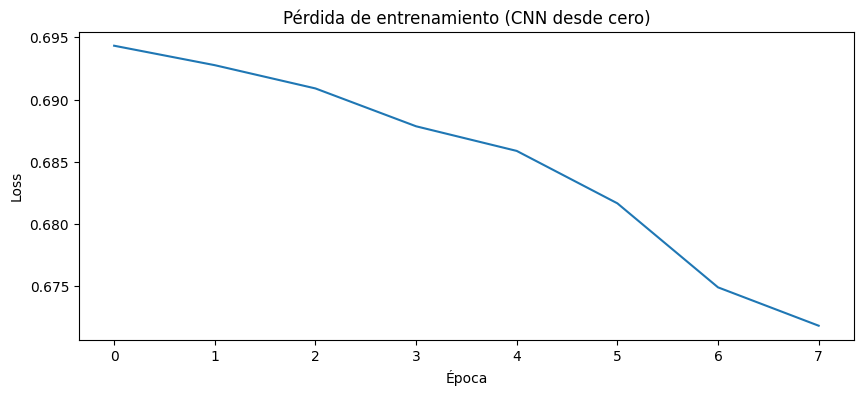

El eje horizontal muestra el avance de las épocas y el vertical muestra la pérdida. En esta figura el conteo empieza en 0: ese primer punto corresponde a la primera época.

La pérdida baja de **0,6943 a 0,6718**. Esto indica que el modelo mejora en los ejemplos de entrenamiento, aunque el cambio es pequeño. Que la pérdida baje no demuestra por sí solo que vaya a responder bien con imágenes nuevas.

### 6.2. ¿Qué pasó en validación?

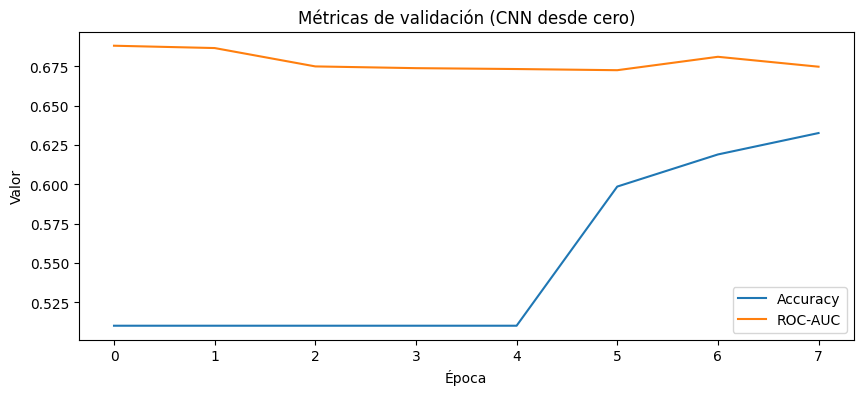

La línea de accuracy muestra la proporción de respuestas correctas. Se mantiene cerca de 51 % durante las primeras cinco épocas y luego sube hasta **63,27 %**. La línea de ROC-AUC se mueve aproximadamente entre 0,67 y 0,69 y termina en **0,6748**.

Entendí que el modelo sí aprende algo, pero todavía le cuesta separar las dos clases. Tampoco puedo asegurar que exista sobreajuste solo con estas figuras, porque aquí no se muestra la pérdida de validación junto a la de entrenamiento.

## 7. La prueba final de la CNN

Después del entrenamiento se usaron las 149 imágenes de prueba. En esta etapa se revisan las respuestas sin seguir ajustando los pesos.

```python
test_acc, test_auc, y_true, y_pred, y_prob = evaluate(model_scratch, test_loader)
print(f"Test accuracy: {test_acc:.4f}")
print(f"Test ROC-AUC: {test_auc:.4f}")
print(classification_report(y_true, y_pred, digits=4))
cm = confusion_matrix(y_true, y_pred)
```

**Qué hace este código:** `evaluate()` compara las respuestas del modelo con las etiquetas reales. `classification_report()` resume los resultados por clase y `confusion_matrix()` cuenta los aciertos y errores de cada tipo.

Estas son las medidas que aprendí a leer:

| Medida | ¿Qué me dice? |
|---|---|
| Accuracy | Qué porcentaje de respuestas fue correcto |
| ROC-AUC | Qué tan bien separa las dos clases según sus puntuaciones; 1 es una separación perfecta y 0,5 es el nivel de una clasificación al azar |
| Precisión | De todo lo que llamó “vidrio”, por ejemplo, cuánto sí era vidrio |
| Recall | De todos los vidrios reales, cuántos encontró |
| F1 | Resume el equilibrio entre precisión y recall |

La CNN básica obtuvo **55,03 % de accuracy** y **0,6191 de ROC-AUC** en el notebook original.


**Cómo leo esta figura:** las filas muestran la clase real y las columnas muestran la respuesta del modelo. El número 0 es vidrio y el 1 es plástico.

| Material real | Dijo vidrio | Dijo plástico |
|---|---:|---:|
| Vidrio | 38 | 38 |
| Plástico | 29 | 44 |

El modelo acertó en **82 imágenes** y falló en **67**. Esta figura es útil porque muestra los errores concretos: confundió 38 vidrios con plástico y 29 plásticos con vidrio.

## 8. Aumento de datos: practicar con variaciones

El siguiente experimento usó la misma CNN, pero cambió un poco las imágenes durante el entrenamiento. La idea es que el modelo practique con distintas versiones de un mismo objeto.

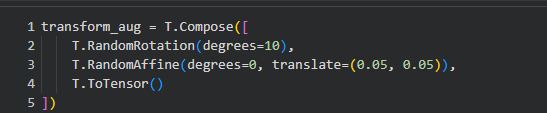

**Qué hace este código:** `RandomRotation(degrees=10)` gira las imágenes hasta 10 grados. `RandomAffine` permite desplazarlas hasta el 5 % de su tamaño en cada dirección. Después, `ToTensor()` las convierte en números.

Estas variaciones se usan en entrenamiento. Las imágenes de validación y prueba mantienen la preparación básica.

Después de 6 épocas, esta red obtuvo **56,38 % de accuracy** y **0,6411 de ROC-AUC** en prueba. La mejora frente a la CNN básica fue pequeña: aproximadamente **1,35 puntos porcentuales**.

Lo que entendí es que mostrar más variaciones puede ayudar, pero no asegura una gran mejora. Además, los dos modelos se entrenaron durante distinta cantidad de épocas, así que no puedo atribuir toda la diferencia a las transformaciones.

## 9. Usar una red que ya había aprendido

También se utilizó **ResNet18**, una red con pesos que ya habían sido entrenados con otras imágenes. A esto se le llama **transferencia de aprendizaje**: aprovechar parte de lo aprendido para una nueva tarea.

Las imágenes se cambiaron a 224 × 224 píxeles y el canal de gris se repitió tres veces para que el modelo pudiera recibirlas. Esto no devuelve el color original; solo adapta el formato.

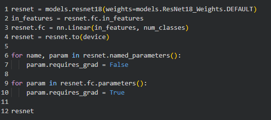

**Qué hace este código:** carga ResNet18 con pesos previos, cambia su última capa para que tenga dos salidas y usa `requires_grad=False` para impedir que se ajusten esos pesos. Después permite entrenar los de la última capa, llamada `fc`.

Primero se entrenó esa última capa durante 4 épocas. Luego se permitió ajustar también el último bloque de la red, `layer4`, durante otras 4 épocas, con cambios más pequeños. Esta segunda parte se llama **ajuste fino**.

El resultado final fue **86,58 % de accuracy** y **0,9562 de ROC-AUC** en prueba. Acertó en **129 de las 149 imágenes**.

| Material real | Dijo vidrio | Dijo plástico |
|---|---:|---:|
| Vidrio | 72 | 4 |
| Plástico | 16 | 57 |

Este modelo confundió más veces el plástico con vidrio que el vidrio con plástico.

### 9.1. ¿Qué parte de la imagen influye en la respuesta?

El Colab también usa **Grad-CAM**, que crea un mapa de colores para explorar qué zonas influyen en la respuesta de ResNet18. Es una ayuda para interpretar el modelo, aunque no demuestra por sí sola que reconozca bien el material.

Para colocar ese mapa encima de la imagen correctamente, ambos deben estar alineados y tener el mismo tamaño o la misma escala de dibujo.

## 10. Comparación de los tres modelos de imágenes

| Modelo | Épocas | Aciertos en prueba | ROC-AUC en prueba |
|---|---:|---:|---:|
| CNN desde cero | 8 | 55,03 % | 0,6191 |
| CNN con aumento de datos | 6 | 56,38 % | 0,6411 |
| ResNet18 con ajuste fino | 4 + 4 | **86,58 %** | **0,9562** |

En esta ejecución, ResNet18 dio el mejor resultado. Superó a la CNN básica en aproximadamente **31,55 puntos porcentuales** de aciertos.

Entendí que aprovechar una red ya entrenada puede ser muy útil. Sin embargo, también cambiaron otras cosas, como el tamaño de las imágenes y la forma de la red. Por eso estos resultados comparan los experimentos completos, no solo el uso de pesos previos.

## 11. Lo que aprendí sobre el sobreajuste con las reseñas

En otro ejercicio del mismo Colab se usan opiniones de películas de **IMDB**. La red intenta distinguir si una opinión es positiva o negativa. Estas cuatro gráficas pertenecen a ese ejercicio de texto, no a las imágenes de residuos.

Cada comentario se convierte en una lista de 10 000 posiciones. Un 1 indica que una palabra aparece y un 0 indica que no aparece. El modelo original tiene dos capas internas de 16 neuronas y una salida para la clasificación.

En todas las gráficas siguientes, el eje horizontal muestra las épocas y el vertical la pérdida. Los valores que menciono son aproximados y se leen de las capturas.

### 11.1. Entrenar más no siempre ayuda

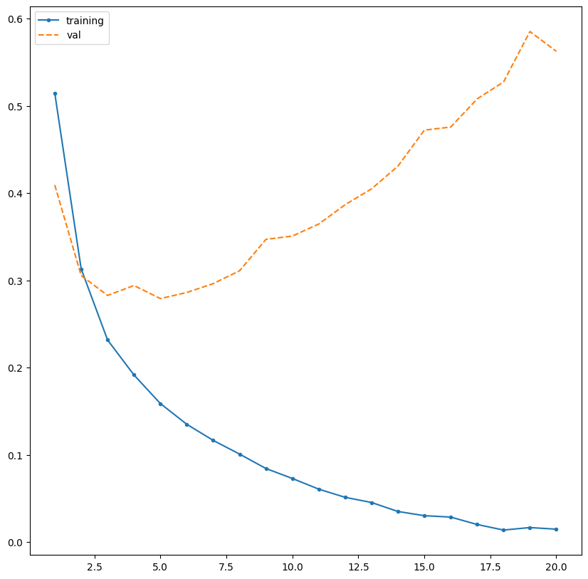

La línea azul es la pérdida de entrenamiento y sigue bajando. La naranja es la pérdida de validación: baja al inicio, llega a su mejor punto cerca de la época 5 y después sube.

**Lo que entendí:** la red mejora con los ejemplos que estudia, pero empieza a responder peor con otros ejemplos. Eso se llama **sobreajuste**. Se parece a aprenderse las respuestas de una práctica sin poder resolver bien preguntas diferentes.

Esta gráfica es importante porque muestra que terminar las 20 épocas no significa obtener el mejor modelo. Según esta curva, convenía conservar los pesos de alrededor de la época 5.

### 11.2. Una red más pequeña puede funcionar mejor

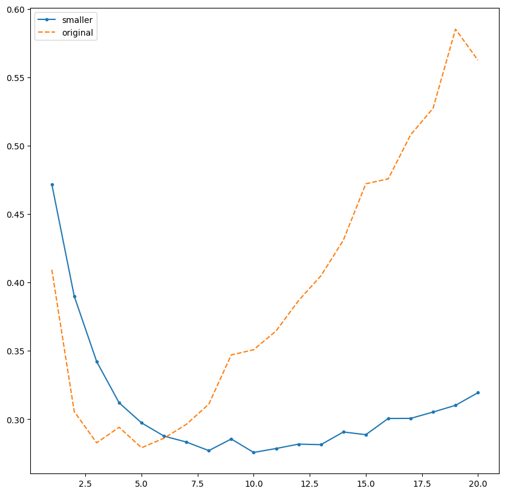

Aquí las dos líneas muestran pérdida de validación. La azul corresponde al modelo pequeño y la naranja al original. El pequeño mejora más despacio, pero su pérdida se mantiene baja durante más tiempo. Su mejor punto está cerca de la época 10 y después empeora un poco.

```python
model2 = models.Sequential()
model2.add(layers.Dense(4, activation='relu', input_shape=(10000,)))
model2.add(layers.Dense(1, activation='sigmoid'))
```

**Qué cambió en el código:** se reemplazaron las dos capas internas de 16 neuronas por una sola de 4. La cantidad de ejemplos se mantuvo igual; lo que se hizo más pequeño fue el modelo.

**Lo que entendí:** una red más grande no siempre aprende mejor para datos nuevos. En esta prueba, reducir su tamaño ayudó a que el resultado fuera más estable, aunque todavía empeoró al final.

### 11.3. Regularización L2: limitar los pesos demasiado grandes

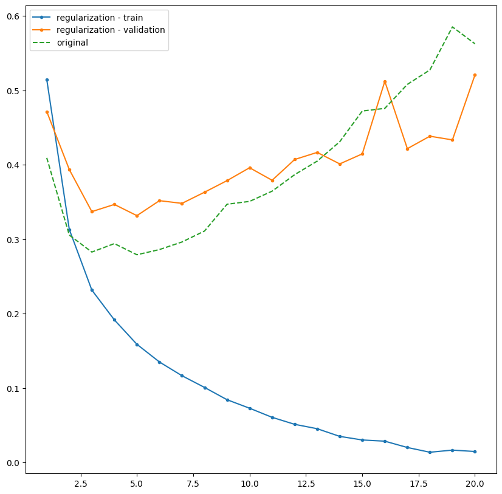

**Hay un detalle importante en esta captura:** la línea azul dice que pertenece al entrenamiento con L2, pero el código toma los datos del modelo original. Por eso no debo usarla para explicar cómo entrenó el modelo con L2.

La línea naranja sí muestra la validación con L2 y la verde corresponde al modelo original. La naranja baja hasta cerca de 0,33 alrededor de la época 5. Después vuelve a subir y tiene varios cambios bruscos. Aunque en varias épocas finales queda por debajo de la verde, no elimina el problema.

```python
layers.Dense(16, activation='relu',
             kernel_regularizer=regularizers.l2(0.001))
```

**Qué hace este código:** agrega una penalización cuando los pesos crecen demasiado. Es una forma de ponerle un límite al aprendizaje para intentar que el modelo no dependa tanto de detalles de sus ejemplos.

La pérdida con L2 incluye esa penalización extra. Por eso no se puede comparar directamente con la pérdida original como si ambas midieran exactamente lo mismo. Tampoco puedo saber la causa del pico de la época 16 mirando solo la figura.

Para corregir la línea azul en Colab, debe usarse el historial del modelo regularizado:

```python
plt.plot(epocas, modelb3.history['loss'], '.-', label='L2: entrenamiento')
```

`epocas` debe tener un valor por cada época de ese historial. La captura incluida conserva el error original; esta línea es la corrección que habría que ejecutar para regenerarla.

### 11.4. Dropout: no depender siempre de las mismas neuronas

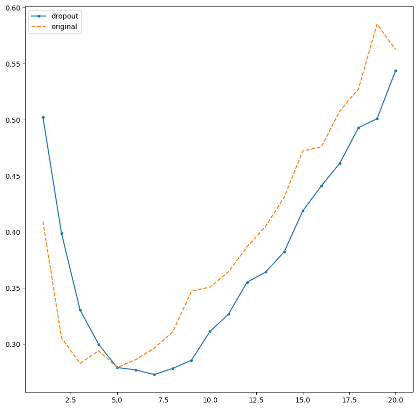

La línea azul corresponde al modelo con dropout y la naranja al original. Ambas son de validación. Con dropout, el mejor punto aparece cerca de la época 7, pero luego la pérdida vuelve a subir.

```python
model4.add(layers.Dense(16, activation='relu'))
model4.add(layers.Dropout(0.5))
```

**Qué hace este fragmento:** después de una capa, dropout pone temporalmente en cero una parte de sus salidas durante el entrenamiento. Con `0.5`, la tasa es del 50 %. En el notebook se coloca después de cada una de las dos capas internas. Al evaluar o predecir, dropout se desactiva.

**Lo que entendí:** esta técnica intenta evitar que la red dependa siempre de las mismas combinaciones. En la gráfica retrasa el sobreajuste, pero no lo elimina. Las neuronas no se borran permanentemente.

### 11.5. ¿Qué me enseñaron estas cuatro gráficas?

| Cambio | Lo que observé |
|---|---|
| Modelo original | Seguir entrenando después del mejor punto empeoró la validación |
| Modelo pequeño | La pérdida se mantuvo baja durante más épocas |
| Regularización L2 | No eliminó el aumento de la pérdida; además, su gráfica necesita una corrección |
| Dropout | Retrasó el mejor punto, pero después también apareció sobreajuste |

Estas comparaciones me enseñaron a mirar los resultados de validación y no quedarme solo con la pérdida de entrenamiento. Una sola ejecución tampoco basta para asegurar que una técnica siempre será la mejor.

## 12. Conclusiones: lo que me llevo del taller

Aprendí que una red neuronal mejora ajustando números internos a partir de ejemplos. También entendí por qué hay que separar los datos: acertar con lo que ya vio no asegura que vaya a responder bien con algo nuevo.

En las imágenes de residuos, el mejor resultado del notebook fue el de ResNet18 con ajuste fino: **86,58 % de aciertos**. La CNN desde cero obtuvo **55,03 %**, y con aumento de datos llegó a **56,38 %**.

En el ejercicio de reseñas entendí el sobreajuste al ver cómo la pérdida de entrenamiento bajaba mientras la de validación subía. Una red más pequeña y dropout ayudaron en distintos momentos, pero ninguna técnica aseguró que el problema desapareciera.

Mi principal aprendizaje es que no basta con ejecutar el código o entrenar durante más tiempo. Hay que entender qué hace cada parte, revisar las gráficas y comprobar los resultados con datos nuevos.

**Material utilizado:** notebook `Redes_neuronales_ss.ipynb` e imágenes compartidas del taller. No se realizaron nuevos entrenamientos para redactar este documento.
