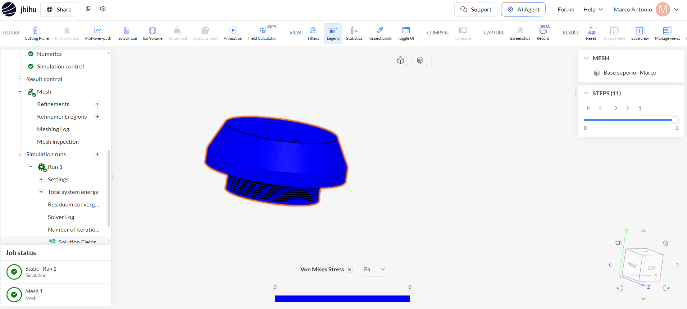

# Resultado de la simulación estructural

## Simulación realizada

Se realizó un **análisis estructural estático en SimScale** sobre la base superior de la boya.

Para la simulación se consideró el material **PET**, la acción de la **gravedad**, un **soporte fijo en la zona de la rosca** y una fuerza de **-10 N en el eje Y** aplicada sobre la parte superior de la pieza.

## Mallado

Antes de ejecutar la simulación se generó una **malla**, que divide el modelo en pequeños elementos para que SimScale pueda calcular los esfuerzos producidos en la pieza.

En la imagen se observa que tanto **Mesh 1** como **Static - Run 1** finalizaron correctamente, indicados mediante los checks verdes.

## Esfuerzo de Von Mises

El resultado mostrado corresponde al **Von Mises Stress**, expresado en **Pascales (Pa)**.

Este resultado permite identificar las zonas de la pieza donde se concentran los mayores esfuerzos mecánicos.

Normalmente:

- **Azul:** menor esfuerzo.
- **Verde:** esfuerzo intermedio.
- **Amarillo:** esfuerzo mayor.
- **Rojo:** zonas de mayor concentración de esfuerzo.

## Resultado observado

En la imagen toda la pieza aparece de color **azul** y la escala de Von Mises muestra aproximadamente **0 Pa**.

Esto significa que en el resultado mostrado **no se están registrando esfuerzos mecánicos significativos en la pieza**.

Sin embargo, debido a que el valor mostrado es prácticamente **0 Pa en toda la geometría**, sería recomendable revisar que la **fuerza de 10 N y el soporte fijo estén correctamente asignados a las superficies correspondientes**.

## Conclusión

La simulación y el mallado finalizaron correctamente. No obstante, el resultado de Von Mises muestra valores cercanos a **0 Pa en toda la pieza**.

Por ello, antes de concluir que la tapa soporta correctamente la carga aplicada, se debe verificar que las condiciones de carga y soporte estén actuando correctamente sobre el modelo.
