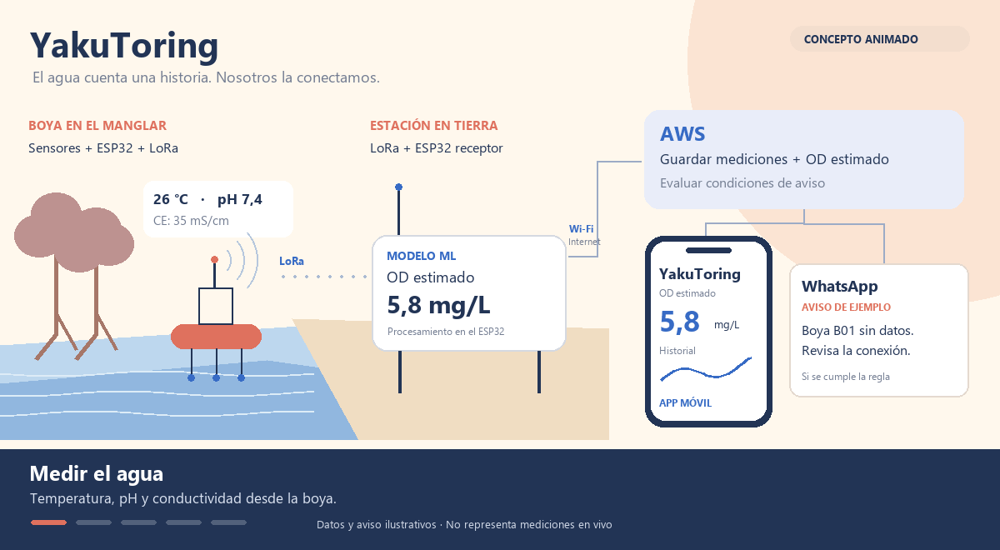
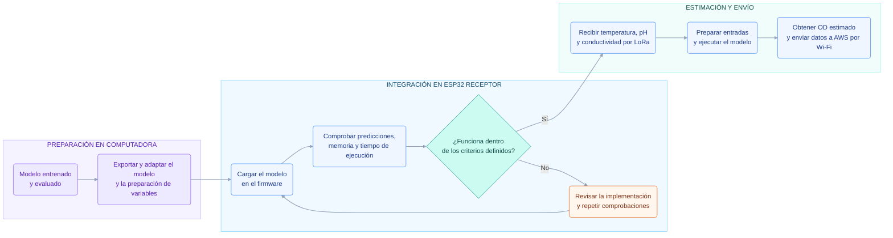
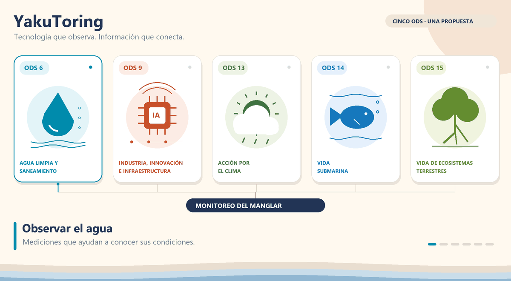

<h1 align="center">🌊 YakuToring</h1>

  <strong>Monitoreo ecológico con IoT y estimación de oxígeno disuelto mediante machine learning</strong> 
  Manglares de Tumbes, Perú

  Equipo 09 · Proyecto Integrador 2026-II 
  Universidad Peruana Cayetano Heredia

  <a href="#proyecto">Proyecto</a> ·
  <a href="#arquitectura">Arquitectura</a> ·
  <a href="#modelo">Machine learning</a> ·
  <a href="#servicios">App y avisos</a> ·
  <a href="#estado">Avances</a> ·
  <a href="#ods">ODS</a> ·
  <a href="#equipo">Equipo</a>

**YakuToring** propone medir temperatura, pH y conductividad eléctrica del agua, estimar el oxígeno disuelto (OD) y facilitar el seguimiento de las condiciones del manglar. La evolución prevista incorpora almacenamiento en AWS, consulta desde una app y avisos por WhatsApp.

> **Estado:** prototipo en desarrollo y validación experimental en laboratorio. La integración cloud, la app y los avisos son funciones propuestas. El desempeño del sensor virtual deberá comprobarse antes de su uso en campo.

  

*Animación conceptual con datos y avisos de ejemplo.*

## El proyecto

### Contexto y problemática

El **Santuario Nacional Los Manglares de Tumbes** alberga especies de importancia ecológica y socioeconómica, como la **concha negra (*Anadara tuberculosa*)**. Las descargas antropogénicas, las alteraciones fisicoquímicas y las variaciones climáticas asociadas al fenómeno El Niño motivan el seguimiento de las condiciones del agua.

El **oxígeno disuelto** es un parámetro relevante para los organismos acuáticos. Su disminución puede generar condiciones de hipoxia y afectar al ecosistema. El proyecto parte de las dificultades de costo, mantenimiento y operación que presenta el monitoreo continuo con instrumentos especializados en ambientes salinos y con presencia de lodo.

### Propuesta: un sensor virtual de OD

Se propone estudiar la relación entre tres variables medidas y el OD mediante un modelo de **regresión supervisada**:

| Variable | Función en el sistema |
|---|---|
| Temperatura | Medición del estado térmico del agua; entrada del modelo. |
| pH | Medición de acidez o alcalinidad; entrada del modelo. |
| Conductividad eléctrica | Medición relacionada con la concentración iónica; entrada del modelo. |
| OD de referencia | Medición con un instrumento de referencia para construir y evaluar el conjunto experimental. |
| OD estimado | Salida del modelo, expresada en mg/L. |

El **sensor virtual** busca reducir la dependencia de la medición directa de OD durante el uso previsto. El instrumento de referencia sigue siendo necesario para entrenar y evaluar el modelo.

### Objetivos

**Objetivo general:** desarrollar un sistema IoT capaz de monitorear variables fisicoquímicas y estimar el OD mediante machine learning, como apoyo al seguimiento ambiental de los ecosistemas de manglar.

| Objetivo específico | Resultado esperado |
|---|---|
| Caracterizar el agua mediante sensores IoT | Adquirir temperatura, pH y conductividad con ESP32 y construir una base de datos experimental asociada al OD de referencia. |
| Desarrollar el modelo predictivo | Estimar OD y analizar el error y la incertidumbre de las predicciones. |
| Validar experimentalmente el sistema | Realizar pruebas en agua dulce, salada y condiciones similares a ambientes estuarinos; identificar límites y factores que afectan la estimación. |
| Apoyar el monitoreo y la conservación | Generar información sobre tendencias y posibles condiciones de estrés ambiental para investigación y seguimiento ecológico. |

## Arquitectura del sistema

La arquitectura propuesta distingue la **boya**, la **estación en tierra** y los **servicios remotos**. El modelo se entrena en una computadora y se adapta para ejecutarlo en el **ESP32 receptor**; AWS recibe las mediciones y el OD ya estimado.

```mermaid
flowchart LR
    subgraph B["BOYA EN EL MANGLAR"]
        S("Sensores<br/>Temperatura · pH · Conductividad")
        E("ESP32 de la boya<br/>Adquirir y preparar datos")
        T("LoRa transmisor")
        S --> E --> T
    end
    subgraph R["ESTACIÓN EN TIERRA"]
        L("LoRa receptor")
        P("ESP32 receptor<br/>Procesar datos y ejecutar modelo ML")
        O("OD estimado + mediciones<br/>Enviar por Wi-Fi")
        L --> P --> O
    end
    subgraph C["SERVICIOS REMOTOS · PROPUESTA FUTURA"]
        A("AWS<br/>Recibir y almacenar datos")
        V("App YakuToring<br/>Mediciones · OD · Historial")
        Q("Evaluar reglas de aviso")
        W("Notificar por WhatsApp<br/>si corresponde")
        A --> V
        A --> Q --> W
    end
    T -- Enlace LoRa --> L
    O -- Internet --> A
    classDef boya fill:#E5F0FC,stroke:#376BC5,color:#223455;
    classDef tierra fill:#FCECE5,stroke:#C8502A,color:#683B30;
    classDef cloud fill:#EDECF9,stroke:#8172B1,color:#393157;
    class S,E,T boya;
    class L,P,O tierra;
    class A,V,Q,W cloud;
    style B fill:#F5F9FE,stroke:#B6CEE9,color:#223455
    style R fill:#FFF8EF,stroke:#EAC6AD,color:#683B30
    style C fill:#F7F5FC,stroke:#D0C7E7,color:#393157
    linkStyle default stroke:#8794A8,stroke-width:1.5px;
```

Los bloques de procesamiento, estimación y envío de la estación corresponden al **mismo ESP32 receptor**. Su capacidad para ejecutar el modelo deberá verificarse con la placa y la versión del modelo seleccionadas.

### Componentes y funciones

| Componente | Ubicación o etapa | Función |
|---|---|---|
| ESP32 de la boya | Boya | Adquirir y preparar las mediciones. |
| Sensor DS18B20 | Boya | Medir temperatura del agua. |
| Sensor de pH | Boya | Medir pH. |
| Sensor de conductividad | Boya | Medir conductividad eléctrica. |
| Módulos LoRa transmisor y receptor | Boya y estación | Transportar las mediciones entre ambos extremos. |
| ESP32 receptor | Estación en tierra | Procesar datos, ejecutar el modelo adaptado y enviar resultados por Wi-Fi. |
| Boya experimental | Manglar / pruebas | Proporcionar soporte físico al sistema. |
| Medidor de OD de referencia | Validación experimental | Obtener el valor de referencia para entrenar y evaluar. |
| Computadora | Desarrollo | Preparar datos, entrenar, comparar y adaptar modelos. |
| AWS y app YakuToring | Integración futura | Almacenar, consultar datos y gestionar avisos. |

## Machine learning y validación

**Entrada:** temperatura, pH y conductividad eléctrica. **Objetivo:** OD medido con el instrumento de referencia. **Predicción:** OD estimado en mg/L.

### Selección del modelo

Se propone **Random Forest de regresión como modelo inicial**. También se consideran regresión lineal y XGBoost. La selección dependerá del desempeño experimental y de la viabilidad de ejecutar el modelo en el ESP32 receptor.

Si el modelo no cumple en validación, se ajustan sus parámetros; si los ajustes previstos no son suficientes, se evalúa otro algoritmo. Los datos de prueba permanecen reservados para la evaluación final.

### Flujo de entrenamiento y evaluación

```mermaid
%%{init: {"theme": "base", "themeVariables": {"fontSize": "12px"}, "flowchart": {"nodeSpacing": 15, "rankSpacing": 20, "padding": 8}}}%%
flowchart LR
    subgraph S1["ADQUISICIÓN EN LABORATORIO"]
        A("Medir temperatura,<br/>pH y conductividad")
        B("Medir OD de referencia<br/>y asociar cada muestra")
        A --> B
    end

    subgraph S2["PREPARACIÓN DE DATOS"]
        C("Revisar calidad<br/>y preparar variables")
        D("Separar experimentos:<br/>entrenamiento, validación y prueba")
        C --> D
    end

    subgraph S3["ENTRENAMIENTO Y VALIDACIÓN"]
        N("Seleccionar modelo inicial:<br/>Random Forest de regresión")
        E("Entrenar el modelo elegido<br/>para estimar OD")
        F("Calcular error<br/>en validación")
        G{"¿Cumple el criterio<br/>de error definido?"}
        Q{"¿Quedan ajustes<br/>por explorar?"}
        H("Ajustar parámetros<br/>del modelo elegido")
        R("Seleccionar otro algoritmo<br/>de regresión")
        N --> E --> F --> G
        G -- No --> Q
        Q -- Sí --> H --> E
        Q -- No --> R --> E
    end

    subgraph S4["EVALUACIÓN Y USO"]
        I("Calcular error final<br/>con la prueba reservada")
        P{"¿Cumple el criterio<br/>de error de prueba?"}
        J("Documentar error, limitaciones<br/>y condiciones de uso")
        K(["Estimar OD · mg/L<br/>dentro de las condiciones evaluadas"])
        L("Documentar error y limitaciones<br/>Modelo no aprobado para uso")
        M("Volver al desarrollo<br/>y reservar una nueva prueba independiente")
        I --> P
        P -- Sí --> J --> K
        P -- No --> L --> M
    end

    B --> C
    D --> N
    G -- Sí --> I
    M -- Revisar datos y modelo --> C

    classDef datos fill:#E0F2FE,stroke:#0284C7,color:#0C4A6E,stroke-width:1.5px;
    classDef preparacion fill:#EFF6FF,stroke:#3B82F6,color:#1E3A8A,stroke-width:1.5px;
    classDef modelo fill:#EDE9FE,stroke:#8B5CF6,color:#5B21B6,stroke-width:1.5px;
    classDef decision fill:#CCFBF1,stroke:#0D9488,color:#134E4A,stroke-width:1.5px;
    classDef revision fill:#FFF7ED,stroke:#EA580C,color:#7C2D12,stroke-width:1.5px;
    classDef resultado fill:#065F46,stroke:#34D399,color:#FFFFFF,stroke-width:2px;

    class A,B datos;
    class C,D preparacion;
    class N,E,F modelo;
    class G,Q,I,J,P decision;
    class H,R,L,M revision;
    class K resultado;

    style S1 fill:#F0F9FF,stroke:#7DD3FC,color:#0C4A6E
    style S2 fill:#F0FDFA,stroke:#99F6E4,color:#134E4A
    style S3 fill:#F5F3FF,stroke:#C4B5FD,color:#5B21B6
    style S4 fill:#F0FDF4,stroke:#BBF7D0,color:#14532D
    linkStyle default stroke:#94A3B8,stroke-width:1.5px;
```

### Criterios de evaluación

El **error de validación** orienta los ajustes y la selección del modelo. El **error de prueba** comprueba el desempeño final con experimentos reservados. Se reportarán **MAE** y **RMSE** en mg/L, junto con **R²**, para describir los resultados. La incertidumbre se analizará mediante un método que deberá definirse y validarse.

Los criterios de aceptación se definirán antes de la evaluación final. **El error promedio y la incertidumbre no son equivalentes.** Si la prueba final no cumple y sus resultados se usan para orientar mejoras, se reservará una nueva prueba independiente.

### Implementación del modelo en el ESP32 receptor

Después de evaluar el modelo, se preparará su implementación en el dispositivo. **El entrenamiento ocurre en la computadora; la estimación de nuevas mediciones ocurre en el ESP32 receptor.**

Se compararán las predicciones de la computadora y del ESP32 con las mismas entradas. Si la adaptación exige cambiar el modelo o sus variables, se volverá al proceso de entrenamiento y evaluación antes de habilitar su uso.

## App, almacenamiento y avisos

Esta etapa amplía el prototipo hacia la consulta remota. **Se plantea como trabajo futuro**, no como funcionalidad ya implementada.

| Función propuesta | Comportamiento esperado |
|---|---|
| Almacenamiento en AWS | Guardar mediciones y estimaciones, asociadas a la boya y al momento de adquisición para construir el historial. |
| App YakuToring | Mostrar temperatura, pH, conductividad, OD estimado, gráficas e historial. |
| Reglas de aviso | Detectar condiciones configuradas, como OD estimado persistentemente bajo o ausencia de datos de una boya. |
| Notificaciones por WhatsApp | Comunicar un aviso al destinatario autorizado mediante una integración de mensajería. |

El umbral ambiental de aviso se definirá por separado del criterio de aceptación del modelo. Los avisos deberán identificar el **OD como estimado**, evitar repeticiones innecesarias y facilitar la revisión de los datos. La configuración de la mensajería y sus pruebas forman parte de la integración pendiente.

## Estado del proyecto
YakuToring se encuentra en desarrollo y validación experimental.

Las exigencias, tareas y avances del equipo se organizan en nuestro tablero de GitHub Projects:

**[Consultar el tablero del proyecto →](https://github.com/users/Marco404-Dev/projects/1)**

## Relación con los ODS

  

El proyecto relaciona su propuesta con las siguientes metas. Esta alineación expresa su orientación; el aporte efectivo dependerá de los resultados y del uso del sistema.

| ODS | Meta específica |
| :---: | :---: |
| **💧ODS 6: Agua Limpia** | **Meta 6.6:** De aquí a 2030, proteger y restablecer los ecosistemas relacionados con el agua, incluidos los humedales y estuarios. |
| **⚙️ODS 9: Industria e Innovación** | **Meta 9.5:** Aumentar la investigación científica y mejorar la capacidad tecnológica de los sectores industriales y de investigación. |
| **☁️ODS 13: Acción por el Clima** | **Meta 13.1:** Fortalecer la resiliencia y la capacidad de adaptación a los riesgos relacionados con el clima y los desastres naturales. |
| **🌊ODS 14: Vida Submarina** | **Meta 14.2:** De aquí a 2020, gestionar y proteger sosteniblemente los ecosistemas marinos y costeros para evitar efectos adversos significativos. |
| **🌳ODS 15: Ecosistemas Terrestres** | **Meta 15.1:** Asegurar la conservación y el uso sostenible de los ecosistemas terrestres y los ecosistemas interiores de agua dulce. |

## Equipo

Somos el **Equipo 09 de Proyecto Integrador 2026-II**, de la **Universidad Peruana Cayetano Heredia**. Integramos Ingeniería Ambiental, Ingeniería Informática e Ingeniería Industrial para desarrollar una propuesta con impacto social, tecnológico y ambiental.

   
  <em>Equipo 09 · Proyecto Integrador 2026-II</em>

| Foto | Nombre | Rol | Intereses |
|------|--------|-----|-----------|
|  | **Ruth Elizabeth Atiro Cobeñas** | Líder del equipo | Innovación social, sostenibilidad |
|  | **Sheila Rocío Calla Mamani** | Responsable de investigación | Gestión ambiental, desarrollo comunitario |
|  | **Benedict Mattew Quispe Paniagua** | Integración Hardware y Software | Computación en la nube, desarrollo web, redes y desarrollo de software |
|  | **Marco Antonio Ancco Quispe** | Programador y Modelador | Programación, análisis de datos y simulación |
|  | **Ivana Francesca Gygax Malca** | Investigadora | Documentación y validación |

## Referencias científicas

- [1] Instituto del Mar del Perú (IMARPE), Informes de evaluación poblacional de concha negra y calidad del medio acuático en la Región Tumbes, Callao, Perú: IMARPE, 2020.
- [2] R. B. Baird, A. D. Eaton, and E. W. Rice, Eds., Standard Methods for the Examination of Water and Wastewater, 23rd ed. Washington, DC, USA: American Public Health Association (APHA), 2017.
- [3] Ministerio del Ambiente (MINAM), Estándares de Calidad Ambiental (ECA) para Agua, Decreto Supremo N° 004-2017-MINAM, Lima, Perú, 2017.
- [4] K. Takahashi and A. Martínez, "El Niño, cambio climático, y el ecosistema de manglares de Tumbes," Instituto Geofísico del Perú (IGP), Lima, Perú, Tech. Rep., 2015.
- [5] Y. Zhi et al., "Prediction of dissolved oxygen in water based on machine learning," Scientific Reports.
- [6] SERNANP, Plan Maestro del Santuario Nacional Los Manglares de Tumbes (2016-2020), Servicio Nacional de Áreas Naturales Protegidas por el Estado, Lima, Perú, 2016.
