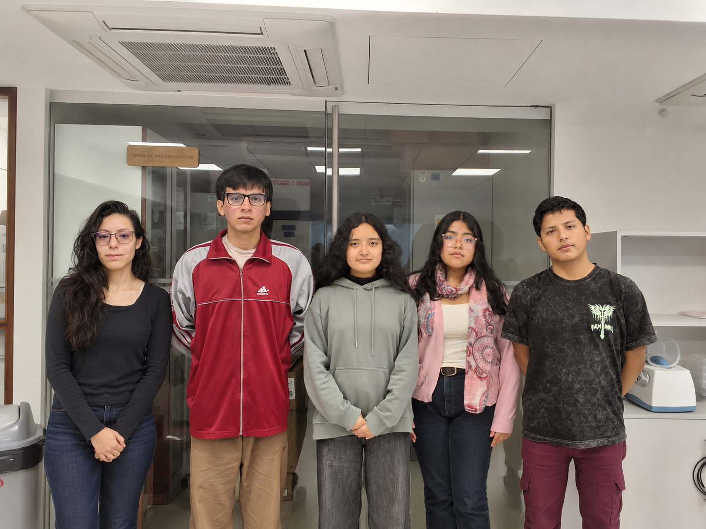

<h1 align="center">🌊 ManglarLab Learning</h1>

<h3 align="center">
Sistema inteligente de monitoreo ecológico para la estimación de Oxígeno Disuelto en los manglares de Tumbes mediante IoT y Machine Learning
</h3>

<p align="center">
<b>Equipo 09 - Proyecto Integrador 2026-II</b><br>
Universidad Peruana Cayetano Heredia
</p>

---

<p align="center">
  
</p>

---

# 👥 Equipo 09 - Proyecto Integrador 2026-II

### Carreras involucradas:
- Ingeniería Ambiental
- Ingeniería Informática
- Ingeniería Industrial

Somos el **Equipo 09** del curso **Proyecto Integrador 2026-II**, conformado por estudiantes de diferentes áreas de ingeniería.

Nuestro objetivo es aplicar metodologías de diseño e innovación para desarrollar soluciones con impacto **social, tecnológico y ambiental**, integrando conocimientos interdisciplinarios para abordar problemáticas reales.

---

# 🌍 Objetivos de Desarrollo Sostenible (ODS)

Nuestro proyecto se encuentra relacionado con los siguientes **Objetivos de Desarrollo Sostenible (ODS):**

- 🌊 **ODS 14: Vida submarina**
- 💧 **ODS 6: Agua limpia y saneamiento**
- 🌎 **ODS 13: Acción por el clima**
- 🌱 **ODS 15: Vida de ecosistemas terrestres**

---

# 📸 Fotografía del Equipo

<p align="center">
  
  <br>
  <em>Equipo 09 - Proyecto Integrador 2026-II</em>
</p>

---

# 👤 Integrantes del Equipo

| Foto | Nombre | Rol | Intereses |
|------|--------|-----|-----------|
|  | **Ruth Elizabeth Atiro Cobeñas** | Líder del equipo | Innovación social, sostenibilidad |
|  | **Sheila Rocío Calla Mamani** | Responsable de investigación | Gestión ambiental, desarrollo comunitario |
|  | **Benedict Mattew Quispe Paniagua** | Integración Hardware y Software | Computación en la nube, desarrollo web, redes y desarrollo de software |
|  | **Marco Antonio Ancco Quispe** | Programador y Modelador | Programación, análisis de datos y simulación |
|  | **Ivana Francesca Gygax Malca** | Investigadora | Documentación y validación |

---

# 📌 Descripción del Proyecto

El **Santuario Nacional Los Manglares de Tumbes** representa uno de los ecosistemas estuarinos más importantes del Perú debido a su alta biodiversidad, capacidad de almacenamiento de carbono y función como zona de reproducción y refugio para especies de importancia ecológica y socioeconómica, como la **concha negra (*Anadara tuberculosa*)**.

Este ecosistema cumple un papel fundamental en la conservación de la biodiversidad marina y en el desarrollo sostenible de las comunidades vinculadas al aprovechamiento de recursos hidrobiológicos.

Sin embargo, los manglares se encuentran expuestos a diversas amenazas ambientales, entre ellas:

- Descargas antropogénicas.
- Alteraciones fisicoquímicas del agua.
- Variaciones climáticas extremas asociadas al **Fenómeno El Niño**.

Estas condiciones pueden modificar el equilibrio del ecosistema y afectar parámetros fundamentales para la supervivencia de organismos acuáticos.

---

# 🌱 Problemática

Uno de los parámetros más importantes para evaluar la salud del ecosistema acuático es el **Oxígeno Disuelto (OD)**.

El oxígeno disuelto representa la cantidad de oxígeno disponible en el agua para los organismos vivos y está relacionado con diversos procesos físicos, químicos y biológicos del ecosistema.

Una disminución significativa del OD puede generar condiciones de **hipoxia**, afectando:

- La supervivencia de organismos acuáticos.
- La biodiversidad del ecosistema.
- Los procesos ecológicos naturales.
- Recursos hidrobiológicos de importancia económica como la concha negra.

Actualmente, el monitoreo continuo del oxígeno disuelto presenta limitaciones debido a:

- Alto costo de sensores especializados.
- Requerimientos de mantenimiento.
- Dificultades de operación en ambientes con alta salinidad.
- Presencia de lodo y condiciones ambientales variables.

Estas limitaciones dificultan implementar sistemas accesibles de vigilancia ambiental continua.

---

# 💡 Propuesta del Proyecto

Este proyecto propone desarrollar un **sistema IoT de vigilancia ambiental temprana** capaz de monitorear variables fisicoquímicas del agua y estimar el nivel de **Oxígeno Disuelto (OD)** mediante modelos de **Machine Learning**.

La propuesta busca reducir la dependencia de sensores especializados de oxígeno mediante la construcción de un:

# 🧠 Sensor Virtual de Oxígeno Disuelto

En lugar de medir directamente el oxígeno mediante sensores especializados de alto costo, el sistema utilizará variables ambientales accesibles:

| Variable | Descripción |
|----------|-------------|
| 🌡️ Temperatura | Influye en la solubilidad del oxígeno en el agua y en procesos biológicos |
| ⚗️ pH | Proporciona información sobre condiciones químicas y procesos ambientales |
| 🌊 Conductividad eléctrica | Relacionada con la concentración iónica y cambios asociados a la salinidad |

Estas variables serán utilizadas para entrenar modelos predictivos capaces de estimar la concentración de oxígeno disuelto presente en el agua.

---

# 🔬 Flujo general del modelo

```text
Temperatura
      |
      |
pH ----|----> Modelo Machine Learning ----> Oxígeno Disuelto estimado
      |
      |
Conductividad eléctrica
```

---

# 🎯 Objetivos del Proyecto

## Objetivo General

Desarrollar un sistema IoT inteligente capaz de monitorear variables fisicoquímicas del agua y estimar el **Oxígeno Disuelto (OD)** mediante modelos de **Machine Learning** como indicador de la calidad ambiental de ecosistemas de manglar.

La propuesta busca integrar sensores ambientales accesibles, procesamiento de datos y modelos predictivos para desarrollar una herramienta tecnológica orientada al monitoreo ecológico continuo.

---

## Objetivos Específicos

### 🌡️ 1. Caracterización ambiental mediante sensores IoT

Diseñar e implementar un sistema basado en **ESP32** capaz de adquirir variables fisicoquímicas del agua relacionadas con la calidad ambiental del ecosistema.

Las variables consideradas son:

- 🌡️ **Temperatura:** Influye en la solubilidad del oxígeno y en los procesos biológicos del ecosistema.
- ⚗️ **pH:** Permite analizar las condiciones químicas del agua.
- 🌊 **Conductividad eléctrica:** Relacionada con la concentración iónica y variaciones asociadas a la salinidad.

La información obtenida permitirá construir una base de datos experimental para analizar la relación entre estas variables y el Oxígeno Disuelto.

---

### 🤖 2. Desarrollo de un modelo predictivo de Oxígeno Disuelto

Establecer la relación matemática y predictiva entre las variables fisicoquímicas del agua y la concentración de **Oxígeno Disuelto (OD)** mediante algoritmos de **Machine Learning**.

El modelo utilizará como variables de entrada:

```text
Temperatura
pH
Conductividad eléctrica
```

para estimar:

```text
Oxígeno Disuelto (OD)
```

El sistema será evaluado mediante métricas de desempeño y análisis de incertidumbre con el objetivo de determinar la confiabilidad de las predicciones.

---

### 🧪 3. Validación experimental del modelo

Evaluar progresivamente el funcionamiento del sistema mediante pruebas controladas en diferentes condiciones del agua.

Inicialmente se considerarán:

- Agua dulce.
- Agua salada.
- Condiciones similares a ambientes estuarinos.

Estas pruebas permitirán:

- Validar el funcionamiento de los sensores.
- Analizar la relación entre variables ambientales y OD.
- Evaluar los límites del modelo predictivo.
- Identificar factores externos que puedan afectar la estimación.

---

### 🌱 4. Monitoreo y conservación ambiental

Desarrollar una herramienta tecnológica accesible que permita analizar la evolución de las condiciones del agua e identificar posibles escenarios de estrés ambiental dentro del ecosistema de manglar.

El sistema busca generar información útil para:

- Investigación ambiental.
- Monitoreo ecológico.
- Evaluación de cambios en la calidad del agua.
- Futuras estrategias de conservación.

---

# 🏗️ Arquitectura General del Sistema

El sistema está compuesto por diferentes módulos integrados:

```text
              Ecosistema Manglar

                     ↓

        ┌────────────┬────────────┐
        │            │            │

  Temperatura       pH      Conductividad

        │            │            │

        └────────────┴────────────┘

                     ↓

                   ESP32

                     ↓

          Procesamiento de datos

                     ↓

          Modelo Machine Learning

                     ↓

        Oxígeno Disuelto estimado

                     ↓

             AWS / Dashboard
```

---

# 🔧 Componentes del Sistema

| Componente | Función |
|------------|---------|
| ESP32 DevKit | Procesamiento y comunicación del sistema |
| Sensor DS18B20 | Medición de temperatura del agua |
| Sensor pH | Medición de condiciones químicas |
| Sensor de conductividad | Estimación de cambios relacionados con salinidad |
| Módulo de comunicación | Transmisión futura de datos |
| Boya experimental | Soporte físico del sistema |

---

# 🤖 Machine Learning

## Planteamiento del problema

El proyecto plantea un problema de **regresión supervisada**, donde el modelo aprende la relación entre variables ambientales medidas y la concentración de Oxígeno Disuelto.

### Variables de entrada:

```text
X = [Temperatura, pH, Conductividad eléctrica]
```

### Variable objetivo:

```text
Y = Oxígeno Disuelto (OD)
```

---

## Flujo de entrenamiento

```text
Sensores ambientales

        ↓

Obtención de datos experimentales

        ↓

Dataset

        ↓

Entrenamiento del modelo

        ↓

Evaluación del desempeño

        ↓

Oxígeno Disuelto estimado
```

---

## Modelos considerados

Como primera aproximación se evaluarán modelos de regresión:

- Regresión lineal.
- Random Forest.
- XGBoost.

La selección final dependerá del desempeño obtenido con los datos experimentales.

---

## Evaluación del modelo

El desempeño será evaluado mediante:

- **MAE:** Error absoluto medio.
- **RMSE:** Error cuadrático medio.
- **R²:** Capacidad explicativa del modelo.

Además, se analizará la incertidumbre asociada a las predicciones para determinar la confiabilidad del sensor virtual.

---

# ☁️ Arquitectura Cloud (Propuesta futura)

Como evolución del sistema se plantea una arquitectura basada en servicios cloud para almacenamiento y visualización remota.

```text
Boya IoT

   ↓

ESP32

   ↓

Comunicación inalámbrica

   ↓

AWS

   ↓

Base de datos

   ↓

Dashboard ambiental
```

Esta arquitectura permitirá:

- Almacenar históricos de medición.
- Consultar datos remotamente.
- Analizar tendencias ambientales.
- Escalar el sistema hacia futuras implementaciones en campo.

---

# 📊 Estado del Proyecto

## ✅ Completado

- Investigación del problema ambiental.
- Definición de la propuesta tecnológica.
- Identificación de variables ambientales.
- Matriz morfológica.
- Diseño conceptual del sistema.
- Diseño preliminar electrónico.
- Diseño mecánico de la boya.
- Simulación estructural.

---

## 🔄 En desarrollo

- Integración de sensores.
- Construcción del prototipo.
- Pruebas experimentales.
- Generación del dataset.
- Desarrollo del modelo Machine Learning.

---

## 🔜 Trabajo futuro

- Validación en condiciones reales del manglar.
- Optimización del modelo predictivo.
- Integración completa con AWS.
- Implementación de dashboard de monitoreo.
- Evaluación con datos ambientales reales.

---

# 📂 Estructura del Repositorio

```text
ManglarSense/

├── README.md

├── documentación/

├── hardware/

├── firmware/

├── machine-learning/

├── cloud/

├── simulaciones/

├── dashboard/

└── resultados/
```

---

# 📚 Referencias Científicas

Los fundamentos del proyecto consideran investigaciones relacionadas con:

- Relación entre temperatura, salinidad y Oxígeno Disuelto.
- Calidad del agua en ecosistemas estuarinos.
- Aplicación de Machine Learning en monitoreo ambiental.
- Modelos predictivos de parámetros fisicoquímicos del agua.
